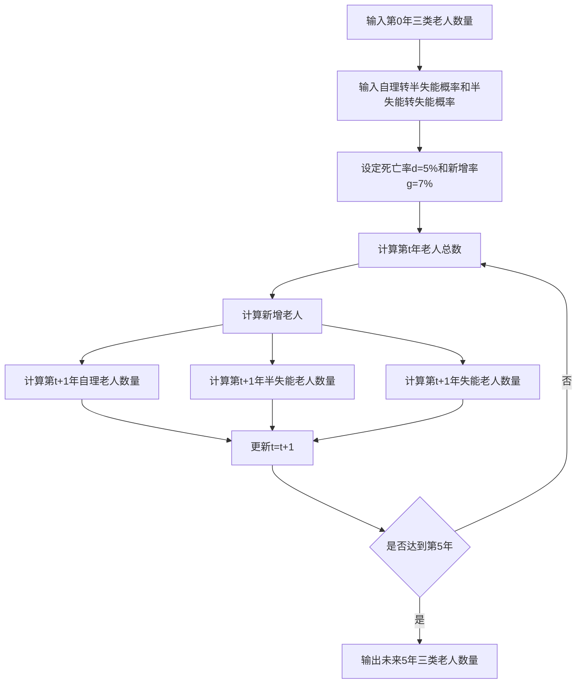
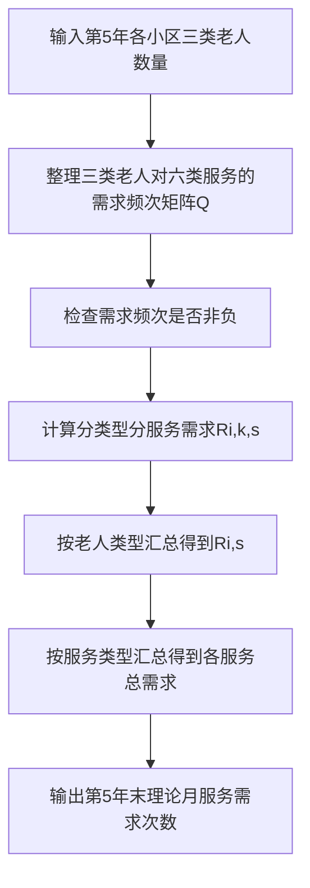
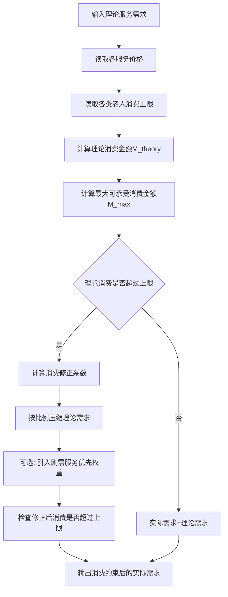
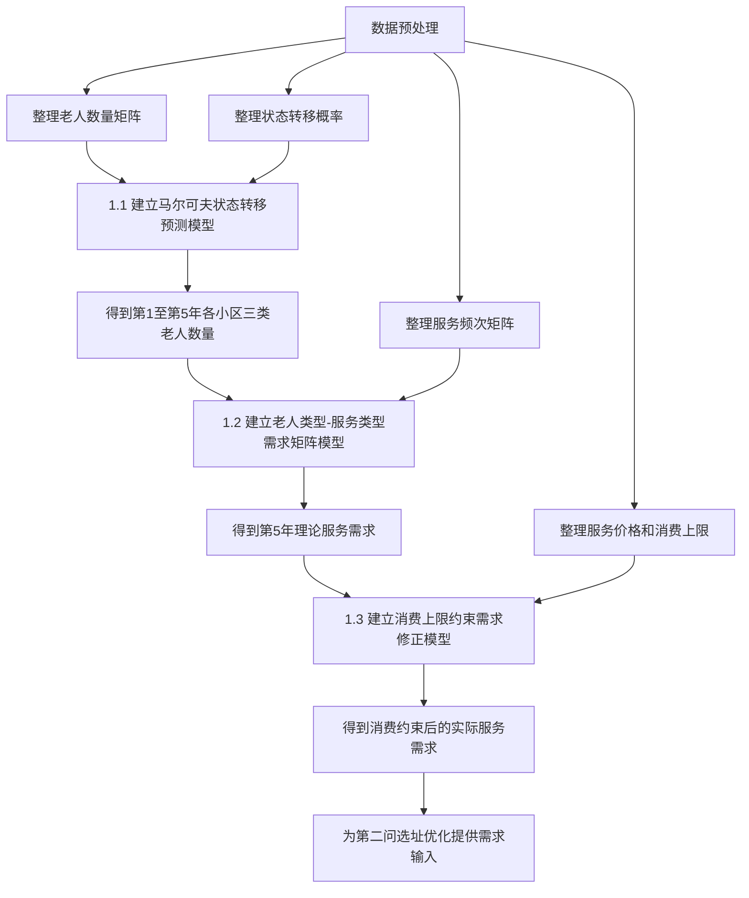
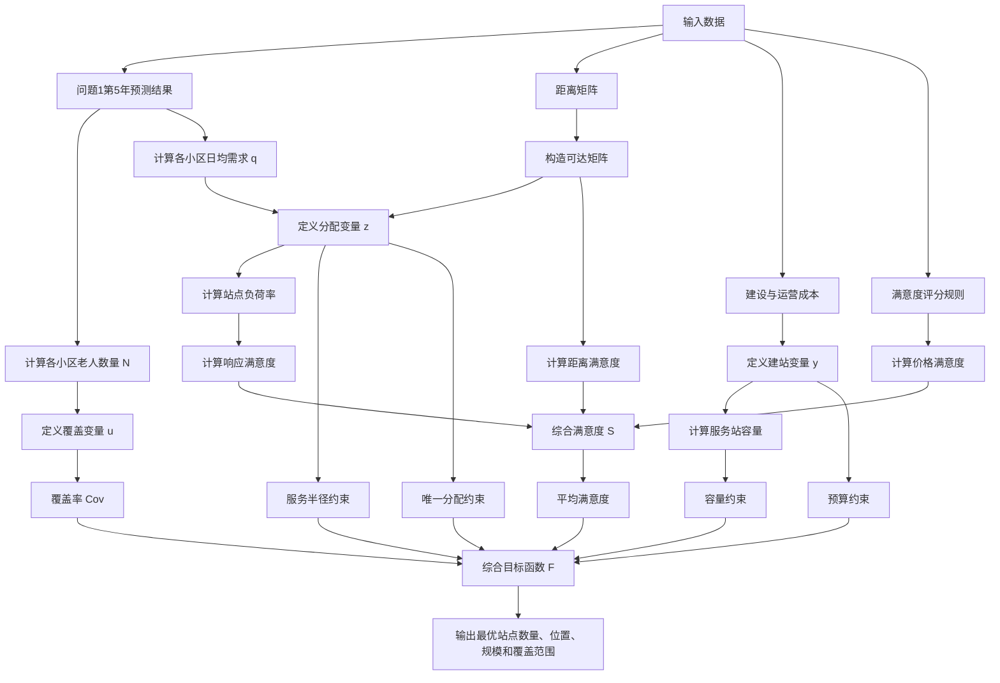

# 2026电工杯B题建模思路

## 一.老人数量预测与服务需求预测模型

### 1.1 数据预处理

在建立模型之前，需要先把题目附件中的原始数据整理成模型可以直接调用的矩阵和向量。

#### **step1：老人数量数据预处理**

将附件 1 中每个小区的老人数量整理为一个10×3的人口矩阵，其中：

- 第 1 列表示自理老人；
- 第 2 列表示半失能老人；
- 第 3 列表示失能老人；
- 行表示不同小区。

预处理时需要检查：

| 检查内容             | 处理方法                                           |
| -------------------- | -------------------------------------------------- |
| 老人数量是否为空     | 若为空，应回查原始附件，不建议随意填补             |
| 老人数量是否为负     | 若出现负数，说明数据录入有误，应修正为原始表真实值 |
| 老人数量是否为整数   | 人口数量最终应取整数                               |
| 三类老人总数是否合理 | 检查每个小区三类老人数量之和是否与小区老人总数一致 |

#### step2：状态转移概率预处理

附件 1 中给出两个关键转移概率：

p~i,12~表示小区 (i) 中自理老人一年后转为半失能老人的概率。

p~i,23~表示小区 (i) 中半失能老人一年后转为失能老人的概率。

将它们整理为转移概率表：

| 小区 | 自理转半失能概率p~i,12~ | 半失能转失能概率p~i,23~ |
| ---- | ----------------------- | ----------------------- |
| 1    | p~1,12~                 | p~1,23~                 |
| 2    | p~2,12~                 | p~2,23~                 |
| ...  | ...                     | ...                     |
| 10   | p~10,12~                | p~10,23~                |

预处理时需要检查两类概率是否在[0,1]之间。

如果附件中概率以百分数形式给出，例如 5%，需要转化为小数0.05。

#### step3:服务需求频次数据预处理

将附件 2 中三类老人对六类服务的月均需求频次整理成一个3×6的需求频次矩阵Q：

其中（k代表行，s代表列）：

| 下标 | 含义       |
| ---- | ---------- |
| k=1  | 自理老人   |
| k=2  | 半失能老人 |
| k=3  | 失能老人   |
| s=1  | 助餐       |
| s=2  | 日间照料   |
| s=3  | 上门护理   |
| s=4  | 康复理疗   |
| s=5  | 助浴       |
| s=6  | 紧急救助   |

预处理时检查矩阵的每个元素是否≥0，因为服务需求次数不能为负。

#### step4: 服务价格与消费上限预处理

- 将附件 2 中服务价格整理为价格向量：
  A=[a~1~，...，a~6~]

  其中 a~s~表示第s类服务的单次价格，单位为元/次。

- 将三类老人月消费上限整理为：
  U=[u~1~,u~2~,u~3~]

​	u~1~：自理老人月服务消费上限；

​	u~2~：半失能老人月服务消费上限；

​	u~3~：失能老人月服务消费上限。

- 预处理时需要检查a~s~和u~k~是否≥0

- 如果服务价格、消费上限以“元/月”“元/次”等不同单位出现，必须统一到：

| 数据       | 统一单位 |
| ---------- | -------- |
| 服务需求   | 次/月    |
| 服务价格   | 元/次    |
| 月消费上限 | 元/人/月 |
| 需求总量   | 次/月    |
| 消费金额   | 元/月    |

------

### 1.2 核心假设

第一问需要做人口和需求预测，因此需要设定合理假设。

| 假设条件                                                     | 合理性说明                                                   |
| ------------------------------------------------------------ | ------------------------------------------------------------ |
| 五年内各小区老人健康状态转移概率保持不变                     | 题目给出固定转移概率，且预测期只有 5 年，短期内可认为状态转移规律稳定 |
| 老人状态只能由自理向半失能、由半失能向失能转移，不考虑逆向恢复 | 题目明确说明失能老人不能恢复为半失能或自理，半失能老人不能恢复为自理 |
| 新增老人默认进入自理老人状态                                 | 新进入 60 岁以上群体的老人通常健康状况相对较好，且题目未给出新增老人失能比例 |
| 自然死亡率对三类老人统一适用                                 | 题目只给出统一自然死亡率，没有区分不同健康状态死亡率，因此采用统一死亡率 |
| 同一类老人具有相同的月均服务需求频次和消费上限               | 附件 2 按老人类型给出平均需求和消费上限，因此可用类型平均值代表该类老人 |

------

### 1.3 老人数量预测模型

#### 模型选择与解释：

本题的老人状态变化具有明显的方向性：

- 自理老人可能变成半失能；
- 半失能老人可能变成失能；
- 失能老人不会恢复；
- 半失能老人不会恢复成自理。

这种“从较健康状态向较差健康状态转移”的过程，正好符合状态转移模型的基本思想。

据此，第一问建立的**基本模型**是**马尔可夫状态转移预测模型**

这个模型的核心思想是：

> 把老人健康状况看成三种状态：自理、半失能、失能。随着时间推移，一部分自理老人会转为半失能，一部分半失能老人会转为失能，同时每年会有老人死亡，也会有新的老人进入老年群体。模型每年更新一次各类老人数量，连续递推 5 次，就可以得到未来 5 年各小区三类老人数量。

它本质上就是一个状态转移预测模型。

此外，普通马尔可夫模型只考虑“状态之间如何转移”，而本题还存在两个现实因素：

1. 老人会自然死亡；
2. 老年人口会新增。

所以本文不是直接使用普通马尔可夫链，而是引入死亡率修正和新增人口补充，建立：

**马尔可夫状态转移 + 死亡率修正 + 新增人口补充的改进模型**

这种模型比简单增长率预测更合理，因为它不仅预测总人数，还能预测不同健康状态老人结构的变化。

------

#### 模型推导：

##### step1：计算每年各小区老人总数

$T_i^t = N_{i,1}^t + N_{i,2}^t + N_{i,3}^t$

式中$T_i^t$表示第t年末小区t的老人总人数。它由自理、半失能、失能三类老人相加得到。

##### step2：计算新增老人数量

题目给出每年新增老人比例为 7%，所以：

$A_i^t = gT_i^t$

式中 $A_i^t$ 表示从第t年到第 t+1年，小区 i 新增进入老年群体的人数。

由于题目没有给出新增老人中半失能和失能比例，因此假设新增老人全部进入自理状态。

##### step3：自理老人数量递推

$N_{i,1}^{t+1} = (1 - d)(1 - p_{i,12})N_{i,1}^{t} + A_{i}^{t}$

这个式子表示：第 t+1 年自理老人数量由两部分组成。

$(1 - d)(1 - p_{i,12})N_{i,1}^{t}$表示原来自理老人中没有死亡，没有转为半失能，即仍然保持自理状态的人数。

$A_{i}^{t}$表示新增进入老年群体的人数，按假设全部计入自理老人。

##### step4：半失能老人数量递推

$N_{i,2}^{t+1} = (1 - d)\left[ p_{i,12}N_{i,1}^{t} + (1 - p_{i,23})N_{i,2}^{t} \right]$

这个式子表示：第 t+1年半失能老人由两部分组成。

$p_{i,12}N_{i,1}^{t}$ 表示由自理老人转化而来的半失能老人。

$(1 - p_{i,23})N_{i,2}^{t}$表示原半失能老人中，没有继续转为失能的人。

外面乘以（1-d）表示扣除自然死亡影响。

##### step5：失能老人数量递推

$N_{i,3}^{t+1} = (1 - d)\left[ p_{i,23}N_{i,2}^{t} + N_{i,3}^{t} \right]$

这个式子表示：第 t+1年失能老人由两部分组成。

$p_{i,23}N_{i,2}^{t}$表示由半失能老人转化而来的失能老人。

$N_{i,3}^{t}$表示原本已经失能的老人。

因为题目说明失能老人不能恢复，所以原失能老人只需要扣除死亡率，不需要考虑转出到其他状态。

------

#### 计算步骤：

------

#### 输出结果：

问题 1.1 最终应输出每个小区未来 5 年三类老人数量。建议用下表表示：

| 小区    | 年份    | 自理老人 | 半失能老人 | 失能老人 | 老人总数 |
| ------- | ------- | -------- | ---------- | -------- | -------- |
| 小区 1  | 第 1 年 |          |            |          |          |
| 小区 1  | 第 2 年 |          |            |          |          |
| ...     | ...     | ...      | ...        | ...      | ...      |
| 小区 10 | 第 5 年 |          |            |          |          |

------

### 1.4 理论服务需求预测模型

#### 模型选择与解释：

题目已经给出：

- 每个小区不同类型老人数量；
- 每类老人对六类服务的月均需求频次。

这说明需求不是凭空预测，而是由“人数”和“人均频次”直接决定。因此用需求矩阵模型最直接、最稳妥。

据此，本文建立了**老人类型—服务类型需求矩阵模型**。

这个模型的核心思想是：

> 第 5 年某小区某类老人的人数 × 该类老人对某项服务的月均需求次数 = 该类老人对该项服务的月需求总次数。

例如，如果某小区第 5 年有 100 名半失能老人，而每名半失能老人每月平均需要 3 次上门护理，那么该小区半失能老人每月上门护理需求就是：100×3=300 

所以问题 1.2 本质上是一个**矩阵乘法模型**

#### 模型推导：

##### **step1：计算分老人类型、分服务类型需求**

$R_{i,k,s}^{theory} = N_{i,k}^5 q_{k,s}$

其中$R_{i,k,s}^{theory}$表示第 5 年末，小区i中第k类老人对第s类服务的理论月需求次数。

##### step2：计算某小区某项服务总需求

$R_{i,s}^{theory} = \sum_{k=1}^{3} R_{i,k,s}^{theory} = \sum_{k=1}^{3} N_{i,k}^5 q_{k,s}$

其中$R_{i,s}^{theory}$表示小区i所有老人对第s类服务的月需求总次数。

##### step3：计算某小区全部服务总需求

$R_i^{theory} = \sum_{s=1}^{6} \sum_{k=1}^{3} N_{i,k}^5 q_{k,s}$

式中$R_i^{theory}$ 表示小区 (i) 六类养老服务的理论月需求总量。

##### step4：计算全区域某项服务总需求

$R_s^{theory} = \sum_{i=1}^{10} R_{i,s}^{theory}$

式中$R_s^{theory}$表示 10 个小区对第s类服务的理论月需求总次数。

------

#### 计算步骤：

------

#### 输出结果：

建议输出两个表：

表 1：各小区六类服务理论月需求

| 小区    | 助餐 | 日间照料 | 上门护理 | 康复理疗 | 助浴 | 紧急救助 | 合计 |
| ------- | ---- | -------- | -------- | -------- | ---- | -------- | ---- |
| 小区 1  |      |          |          |          |      |          |      |
| 小区 2  |      |          |          |          |      |          |      |
| ...     | ...  | ...      | ...      | ...      | ...  | ...      | ...  |
| 小区 10 |      |          |          |          |      |          |      |

表 2：全区域六类服务理论月需求

| 服务类型 | 理论月需求次数 |
| -------- | -------------- |
| 助餐     |                |
| 日间照料 |                |
| 上门护理 |                |
| 康复理疗 |                |
| 助浴     |                |
| 紧急救助 |                |

------

### 1.5 消费约束下服务需求修正模型

#### 模型选择与解释：

问题 1.2 算出的是“理论需求”，但现实中老人是否真的购买服务，还受到支付能力限制。

例如某类老人理论上每月需要很多护理、康复、助浴服务，但如果这些服务总费用超过该类老人月服务消费上限，那么实际需求就不能完全实现。

而且题目明确要求考虑老人消费能力，这说明理论需求不能直接作为最终服务需求。因此需要把服务需求从想要的需求修正为付得起的需求，这正是消费约束模型要解决的问题。

因此问题 1.3 需要建立一个**消费约束下的服务需求修正模型**：

> 先计算理论需求对应的总消费金额，再与消费上限比较；如果没有超过上限，则理论需求就是实际需求；如果超过上限，则按一定比例压缩服务需求，使总消费不超过消费上限。

------

#### 模型推导：

##### step1:计算理论消费金额

$M_{i,k}^{theory} = \sum_{s=1}^{6} R_{i,k,s}^{theory} a_s$

式中$M_{i,k}^{theory}$表示小区i中第k类老人如果完全满足理论服务需求，每月需要支付的总金额。

##### step2：计算最大可承受消费金额

$M_{i,k}^{max} = N_{i,k}^{5} u_k$

式中$M_{i,k}^{max}$表示小区i中第k类老人整体每月最多可以承受的服务消费金额。

例如，如果某小区有 100 名半失能老人，每人每月消费上限是 300 元，那么该小区半失能老人整体消费上限就是：100×300=30000 元/月

##### step3：判断理论消费是否超过消费上限

若$M_{i,k}^{theory}$≤$M_{i,k}^{max}$，说明理论服务需求在消费能力允许范围内，因此：

$R_{i,k,s}^{real} = R_{i,k,s}^{theory}$        $R_{i,k,s}^{real}$ 为消费约束后的实际服务需求次数，$R_{i,k,s}^{theory}$为理论服务需求。

否则说明理论需求无法完全实现，需要进行需求压缩。

##### step4：计算消费修正系数

$\theta_{i,k} = \min\left(1, \frac{M_{i,k}^{max}}{M_{i,k}^{theory}}\right)$

$\theta_{i,k}$表示理论需求能够实现的比例。

如果＝1说明不需要削减。

如果=0.8说明理论需求中大约只有 80% 能够被实际支付能力支撑。

##### step5:修正服务需求

基础修正模型为：

$R_{i,k,s}^{real} = \theta_{i,k} R_{i,k,s}^{theory}$

含义：对小区 (i) 中第 (k) 类老人所有服务需求按同一比例进行压缩，使实际需求总费用不超过消费上限。

#### 模型优化：

因为不同服务的重要程度不同，可以在基础模型上加入服务优先级

例如：

| 服务     | 特点                   |
| -------- | ---------------------- |
| 紧急救助 | 安全兜底，刚需程度最高 |
| 上门护理 | 半失能、失能老人刚需   |
| 助浴     | 失能老人生活照护刚需   |
| 康复理疗 | 健康维持服务           |
| 助餐     | 日常生活服务           |
| 日间照料 | 可被家庭照护部分替代   |

因此可以引入服务优先级权重，满足：

$\omega_s \ge 0$

$\sum_{s=1}^{6} \omega_s = 1$

一种简单处理方式是：

$R_{i,k,s}^{real} = R_{i,k,s}^{theory} \left[ \theta_{i,k} + (1 - \theta_{i,k}) \omega_s \right]$

这个式子的含义是：

- 当消费能力充足时，需求不削减；
- 当消费能力不足时，刚需服务因为权重较高，会保留更多需求；
- 非刚需服务削减幅度更大。

但是这种改进模型计算后，需要再次检查：

$\sum_{s=1}^{6} R_{i,k,s}^{real} a_s \le M_{i,k}^{max}$

如果超出消费上限，则需要进行二次归一化：

$R_{i,k,s}^{real} \leftarrow R_{i,k,s}^{real} \times \frac{M_{i,k}^{max}}{\sum_{s=1}^{6} R_{i,k,s}^{real} a_s}$​

可以在论文中写：

> 本文首先构建消费约束比例修正模型，在此基础上进一步引入服务刚需权重，对紧急救助、上门护理、助浴等刚性服务给予更高保留比例，从而使消费约束后的服务需求更符合养老服务的现实特点。

------

#### 计算步骤：

------

#### 输出结果:

问题 1.3 最终输出消费约束后的实际服务需求。

| 小区    | 助餐 | 日间照料 | 上门护理 | 康复理疗 | 助浴 | 紧急救助 | 合计 |
| ------- | ---- | -------- | -------- | -------- | ---- | -------- | ---- |
| 小区 1  |      |          |          |          |      |          |      |
| 小区 2  |      |          |          |          |      |          |      |
| ...     | ...  | ...      | ...      | ...      | ...  | ...      | ...  |
| 小区 10 |      |          |          |          |      |          |      |

还可以增加一个对比表：

| 小区   | 理论需求总次数 | 消费约束后需求总次数 | 需求实现率 |
| ------ | -------------- | -------------------- | ---------- |
| 小区 1 |                |                      |            |
| 小区 2 |                |                      |            |
| ...    | ...            | ...                  | ...        |

------

### 1.6 第一问总流程

第一问完整建模流程如下：

------

# 二.服务站选址与规模优化模型

### 2.1 模型选择与解释

问题2要求基于问题 1 预测的第 5 年末每个小区老人数量与消费约束的服务需求量，考虑服务站选址与规模优化问题，

可将其抽象为：

> 在 10 个小区中选择若干个小区建设养老服务站，并为每个服务站确定规模，使第 5 年末老人服务需求尽可能被覆盖，同时老人到服务站的距离、服务响应能力、价格因素带来的满意度尽可能高。

该问题不是单纯的最短距离选址问题，因为它同时包含：

1. **是否建站**：在哪些小区建设服务站；
2. **建多大**：每个站点选择小型、中型或大型；
3. **由谁服务谁**：每个小区老人分配到哪个服务站；
4. **是否满足服务半径**：超过 1000 米不产生有效服务；
5. **是否满足容量**：服务站每日服务能力有限；
6. **是否满足预算**：总建设成本不超过 120 万元；
7. **如何兼顾两个目标**：覆盖率高、满意度高。

因此，适合建立**混合整数规划模型**，其中站点建设、规模选择、服务分配是 0-1 决策变量，满意度、有效服务量、覆盖率等是连续或派生变量。

------

### 2.2 数据预处理

#### Step1:数据清洗与标准化

设小区集合为：
$I={1,2,\cdots,10}$

其中每个小区既可能是需求点，也可能是候选建站点。因此候选服务站集合也设为：
$J={1,2,\cdots,10}$

服务站规模集合为：
$K={S,M,L}$

其中：

- S：小型服务站；
- M：中型服务站；
- L：大型服务站。

服务类型集合为：
$R={1,2,\cdots,6}$

分别对应：助餐；日间照料；上门护理；康复理疗；助浴；紧急救助。

#### step2：距离矩阵预处理

设d~ij~表示小区i到小区j的距离，单位为米。

由于题目规定有效服务半径不超过 1000 米，因此构造可达矩阵：

$a_{ij}=\begin{cases}1, & d_{ij}\leq 1000 \\0, & d_{ij}>1000\end{cases}$

物理意义：

> 式中 $a_{ij}=1$表示如果在小区j建设服务站，则该服务站可以有效服务小区i；若 $a_{ij}=0$，说明距离超过 1000 米，小区i的老人不会选择小区j的服务站。

#### step3：需求量预处理

问题 1 得到的是第 5 年末各小区各项服务的月需求次数。设$Q_{ir}$表示第 (i) 个小区对第 (r) 类服务的月理论需求次数，单位为次/月。

则小区 (i) 的总月需求量为：
$Q_i=\sum_{r\in R}Q_{ir}$

由于服务站能力以“人次/日”为单位，需将月需求转换为日需求。若按每月 30 天计，则：
$q_i=\frac{Q_i}{30}$

物理意义：

> 式中 $q_i$表示小区i每日平均服务需求人次，是判断服务站容量是否足够的核心数据。

#### step4：老年人口数据预处理

设$N_i$表示第 5 年末小区 (i) 的老人总数。

全区域老人总数为：$N=\sum_{i\in I}N_i$

物理意义：

> N用于计算区域整体服务覆盖率。

------

### 2.3 核心假设

#### 假设 1：每个小区老人统一选择满意度最高的服务站

题目已给出“老人只选择满意度最高的服务站”。因此模型中每个小区的需求只分配给一个服务站。

合理性说明：

> 该假设简化了老人选择行为，避免同一小区需求被多个站点随意拆分，更符合社区养老中“就近、熟悉、稳定服务”的实际情形。

#### 假设 2：服务站能力与规模成正比，且容量固定

设小型、中型、大型服务站的日最大服务能力分别为：
$Cap_S=1000,\quad Cap_M=2000,\quad Cap_L=3000$

合理性说明：

> 题目明确给出小型、中型、大型服务站对应的日服务能力上限，因此可将服务能力视为由规模决定的固定参数。

#### 假设 3：超出 1000 米服务半径的需求不产生有效服务

合理性说明：

> 嵌入式社区养老强调“家门口养老服务”，服务距离过远会显著降低可达性，因此题目规定超出距离不产生有效服务。

#### 假设 4：第 5 年末需求量在规划期内稳定

​	问题 2 以问题 1 的第 5 年末需求为基础进行静态规划，即认为选址时面对的是稳定的第 5 年需求。

合理性说明：

> 服务站建设是中长期规划，直接使用第 5 年需求可以避免短期低估规模，增强方案的前瞻性。

#### 假设 5：同一服务站对其覆盖小区采用统一响应水平

服务响应满意度与服务站负荷率相关。若某服务站承担需求越接近其容量上限，则服务响应越慢，满意度越低。

合理性说明：

> 实际养老服务中，人员、床位、设备等资源有限，站点负荷越高，排队、等待和预约延迟越明显，因此用负荷率描述响应能力具有现实意义。

------

### 2.4 满意度函数构建

题目规定满意度由距离、服务响应、价格共同决定，且取值范围为 0.6 到 1。

因此构造综合满意度：
$S_{ij}=\alpha_d S^d_{ij}+\alpha_r S^r_{ij}+\alpha_p S^p_i$

并满足：
$\alpha_d+\alpha_r+\alpha_p=1,\qquad$
$\alpha_d,\alpha_r,\alpha_p\geq 0$

 物理意义：

> 式中 $S^d_{ij}$表示老人到服务站的距离满意度，$S^r_{ij}$表示服务响应满意度，$S^p_i$表示价格满意度。权重 $\alpha_d,\alpha_r,\alpha_p$用于体现不同满意度因素的重要性。

------

#### 2.4.1 距离满意度

服务距离越近，满意度越高；超过 1000 米无效。可构造如下线性距离满意度函数：
$S^d_{ij}=\begin{cases}1-0.4\cdot \dfrac{d_{ij}}{1000}, & d_{ij}\leq 1000\\0, & d_{ij}>1000\end{cases}$

物理意义：

> 当距离为 0 时，距离满意度为 1；当距离达到 1000 米时，距离满意度降至 0.6；超过 1000 米则不产生有效服务。

#### 2.4.2 服务响应满意度

设服务站 (j) 的负荷率为：
$\rho_j=\frac{D_j}{Cap_j}$

其中：$D_j=\sum_{i\in I}q_i z_{ij}$
物理意义： 

$D_j$表示服务站 j 每日承担的服务需求量，$\rho_j$表示服务站资源使用强度。负荷率越高，响应越慢。

可构造响应满意度：
$S^r_{ij}=1-0.4\rho_j$

并保证：$0\leq \rho_j\leq 1$

物理意义：

> 当服务站负荷率接近 0 时，响应满意度接近 1；当服务站满负荷运行时，响应满意度降至 0.6。

#### 2.4.3 价格满意度

问题 2 中服务价格通常由附件 2 给定，因此价格满意度可视为已知参数或由附件 5 评分规则计算得到。

设老人实际消费水平与消费上限的比值为：
$\eta_i=\frac{P_i}{L_i}$

其中P_i：小区 i 老人预计月均服务消费；L_i：小区 i 老人月服务消费上限。

价格满意度可设为：
$S^p_i=1-0.4\eta_i$

并限制：$0\leq \eta_i\leq 1$

物理意义：

> 当老人服务消费远低于消费上限时，价格满意度较高；当消费接近上限时，价格满意度降低。

------

### 2.5 服务覆盖率函数构建

题目规定服务覆盖率为：

> 至少享受一项养老服务的老年人数占老年总人口的比例。

因此定义覆盖率：
$Cov=\frac{\sum_{i\in I}N_i u_i}{\sum_{i\in I}N_i}$

物理意义：

> 分子表示被有效服务站覆盖的小区老人数量，分母表示全区域老人总数。

若小区 i 被某个站点有效服务，则：
$u_i=\sum_{j\in J}z_{ij}$

因为每个小区最多分配给一个服务站，所以：
$\sum_{j\in J}z_{ij}\leq 1,\qquad \forall i\in I$

------

### 2.6 实际有效服务人次模型

题目规定：

> 实际有效服务人次 = 理论需求人次 × 服务满意度。

对于小区 i，若由服务站 j 服务，则其日实际有效服务人次为：
$E_i=q_i\sum_{j\in J}S_{ij}z_{ij}$

物理意义：

> 理论需求 (q_i) 并不一定全部转化为有效服务，满意度越高，需求转化率越高。

区域总实际有效服务人次为：
$E=\sum_{i\in I}E_i$

------

#### 2.7 平均满意度模型

区域平均满意度可按老人数量加权：
$\bar{S}=\frac{\sum_{i\in I}N_i\sum_{j\in J}S_{ij}z_{ij}}{\sum_{i\in I}N_i u_i}$

物理意义：

> 被覆盖老人越多的小区，其满意度对区域平均满意度影响越大。

为避免分母为 0，可在求解中要求至少建设一个服务站，并至少覆盖一个小区：$\sum_{j\in J}x_j\geq 1$

------

### 2.7 约束条件建立

#### 2.7.1 建站规模唯一性约束

每个小区最多建设一个服务站，且最多选择一种规模：
$\sum_{k\in K}y_{jk}\leq 1,\qquad \forall j\in J$

> 一个小区不能同时建设小型、中型和大型多个服务站。

#### 2.7.2 建站状态与规模变量关系

$x_j=\sum_{k\in K}y_{jk},\qquad \forall j\in J$

> 如果小区 (j) 选择某一规模，则 (x_j=1)；否则 (x_j=0)。

#### 2.7.3 建设预算约束

设  C^b_k为规模 k 的建设成本，则总建设成本不超过 120 万元：
$\sum_{j\in J}\sum_{k\in K}C^b_k y_{jk}\leq B$

其中B=120

物理意义：

> 该式保证服务站建设方案不会超过政府建设预算。

#### 2.7.4 服务半径约束

只有在距离不超过 1000 米且小区 j 建站时，小区 i 才能分配给服务站 j：
$z_{ij}\leq a_{ij},\qquad \forall i\in I,\ j\in J$

同时：$z_{ij}\leq x_j,\qquad \forall i\in I,\ j\in J$
物理意义：

> 第一条约束保证不能跨越 1000 米服务半径；第二条约束保证小区 i 只能被已经建站的小区 j 服务。

#### 2.7.5 每个小区最多选择一个服务站

$\sum_{j\in J}z_{ij}\leq 1,\qquad \forall i\in I$

物理意义：

> 该式体现“老人只选择满意度最高的服务站”的行为基础，避免同一小区需求被多个服务站重复计算。

#### 2.7.6 服务站容量约束

服务站 j 的日服务能力为：$Cap_j=\sum_{k\in K}Cap_k y_{jk}$

其中：
$Cap_S=1000,\quad Cap_M=2000,\quad Cap_L=3000$

服务站承担的日需求量不能超过容量：
$\sum_{i\in I}q_i z_{ij}\leq \sum_{k\in K}Cap_k y_{jk},\qquad \forall j\in J$

物理意义：

> 该式保证分配给某服务站的总日需求不会超过其服务能力。

2.7.7 负荷率约束
$\rho_j=\frac{\sum_{i\in I}q_i z_{ij}}{\sum_{k\in K}Cap_k y_{jk}},\qquad \forall j\in J$

由于分母可能为 0，实际求解时建议使用线性形式：

并设置：$0\leq \rho_j\leq x_j$

物理意义：

> 若服务站 j 未建设，则 $x_j$=0，从而 $\rho_j$=0；若服务站建设，则 $\rho_j$ 表示实际负荷率。

#### 2.7.8 满意度最高选择约束

题目要求老人选择满意度最高的服务站。可用以下方式实现。

对于小区 i，其被选服务站 j 应满足：
$S_{ij}z_{ij}\geq S_{ih}x_h-M(1-z_{ij}),\qquad \forall i\in I,\ j,h\in J$

其中 M 为足够大的常数。

物理意义：

> 若 $z_{ij}=1$，表示小区 i 选择服务站 j，则该服务站满意度不低于其他所有可选服务站。

为了降低模型复杂度，也可采用两阶段处理：

1. 先求出每个小区对所有可达候选站点的满意度；
2. 在给定建站方案后，将该小区分配给满意度最高且容量允许的站点。

------

### 2.8 目标函数设计

问题要求“服务覆盖率和服务满意度尽可能高”，这是典型的双目标优化问题。

#### 2.8.1 目标一：最大化服务覆盖率

$\max Cov=\frac{\sum_{i\in I}N_i u_i}{\sum_{i\in I}N_i}$
物理意义：

> 尽可能让更多老人至少享受到一项养老服务。

#### 2.8.2 目标二：最大化平均满意度

$\max \bar{S}=\frac{\sum_{i\in I}N_i\sum_{j\in J}S_{ij}z_{ij}}{\sum_{i\in I}N_i u_i}$

物理意义：

> 不仅要覆盖老人，还要尽可能保证老人对服务距离、响应速度和价格的综合感受较好。

#### 2.8.3 综合加权目标函数

为了便于求解，可将双目标转化为单目标：
$\max F=\lambda Cov+(1-\lambda)\bar{S}$

其中：$0\leq \lambda \leq 1$

物理意义：

> $\lambda$表示覆盖率的重要程度。如果政府更重视普惠覆盖，可取 $\lambda=0.6\sim0.8$；如果更重视服务质量，可取 $\lambda=0.4\sim0.6$。

这里我们取0.6，理由：

> 社区养老服务首先要保证“有服务可享”，即覆盖率应略高于满意度权重；在满足覆盖的基础上，再提升满意度。

------

### 2.9 完整优化模型

综合以上内容，问题 2.1 的数学模型可写为：
$\max F=\lambda Cov+(1-\lambda)\bar{S}$

约束条件见上述分析

------

### 2.10 年度利润计算模型

问题 2.3 还要求计算每个服务站预计年度利润。虽然利润不是问题 2.1 的核心优化目标，但可以作为方案评价指标。

设：

- $p_r$：第 r 类服务单次收费；
- $c_r$：第 r 类服务单次直接支出；
- $Q_{ir}$：小区 i 对服务 r 的月需求；
- $S_{ij}$：小区 i 对服务站 j 的满意度；
- $C^o_k$：规模 k 服务站年运营成本。

服务站 j 的年服务收入为：
$Rev_j=12\sum_{i\in I}\sum_{r\in R}p_r Q_{ir}S_{ij}z_{ij}$

物理意义：

> 月需求乘以满意度得到实际有效服务次数，再乘以单次收费和 12 个月，得到年度收入。

服务站 j 的年直接服务支出为：
$Cost^{ser}*j=12\sum*{i\in I}\sum_{r\in R}c_r Q_{ir}S_{ij}z_{ij}$

服务站 j 的年运营成本为：
$Cost^{op}*j=\sum*{k\in K}C^o_k y_{jk}$

因此服务站 j 的年度利润为：

$Profit_j=Rev_j-Cost^{ser}_j-Cost^{op}_j$

> 年度利润等于服务收入减去直接服务成本和固定运营成本。

------

### 2.11 建模流程图

论文表述参考：

> 针对问题 2，本文建立了一个带预算约束、容量约束、服务半径约束和满意度评价的混合整数规划模型。模型以 10 个小区为候选服务站点，以小型、中型、大型三类服务站为规模选择对象，设置建站变量、规模变量和小区—服务站分配变量。首先根据问题 1 预测得到的第 5 年末老人数量与服务需求量，将月需求转换为日均服务需求；其次利用小区间距离矩阵构造 1000 米服务半径内的可达矩阵；然后根据距离满意度、响应满意度和价格满意度计算综合满意度；最后在总建设预算不超过 120 万元、服务站容量不超限的条件下，最大化服务覆盖率与平均满意度的加权综合目标。该模型既能确定服务站数量、位置和规模，又能输出每个服务站覆盖的小区、预计服务负荷、老人满意度和年度利润，能够较全面地反映嵌入式社区养老服务站建设与优化问题的实际需求。

------

