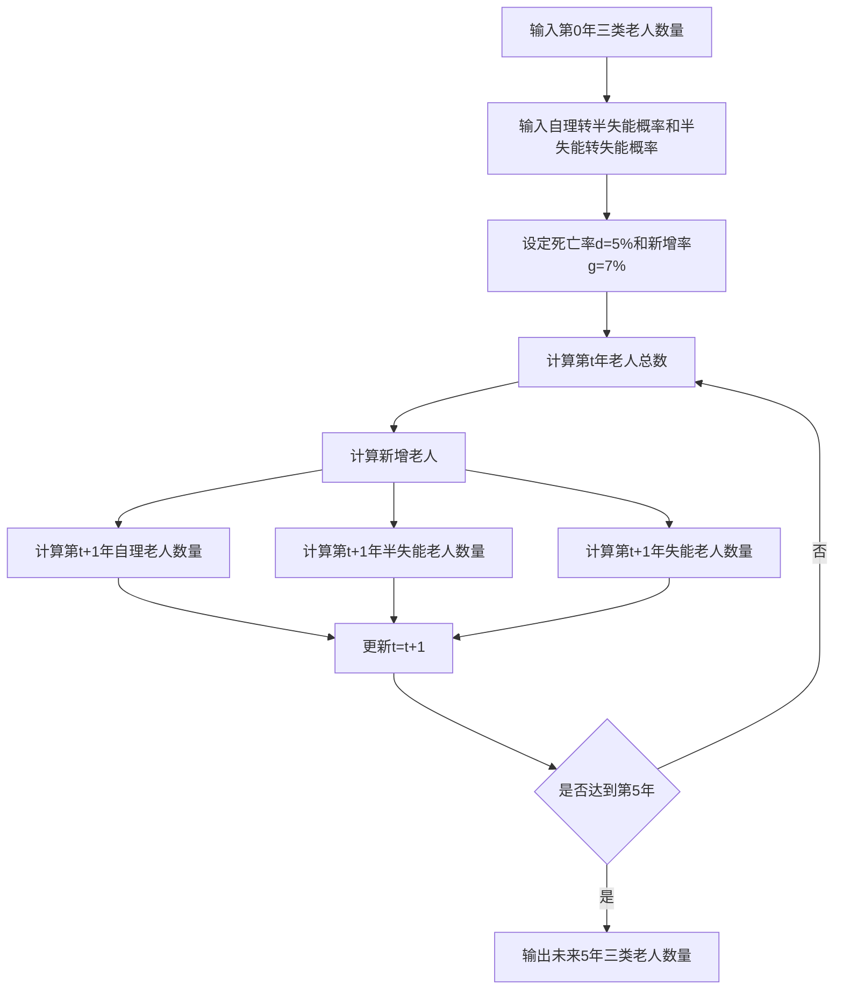
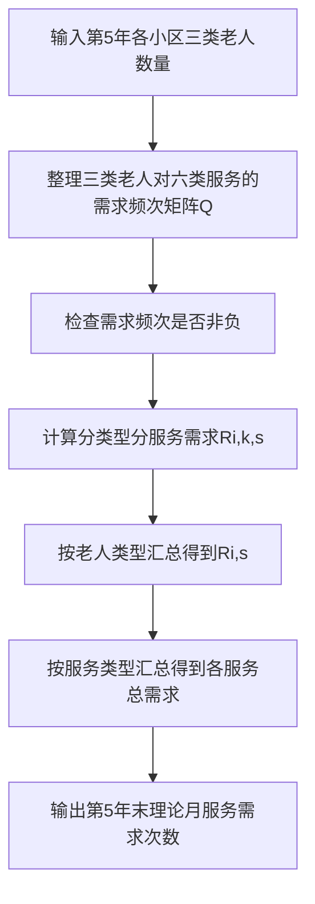
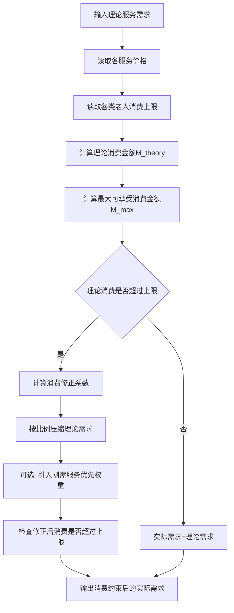
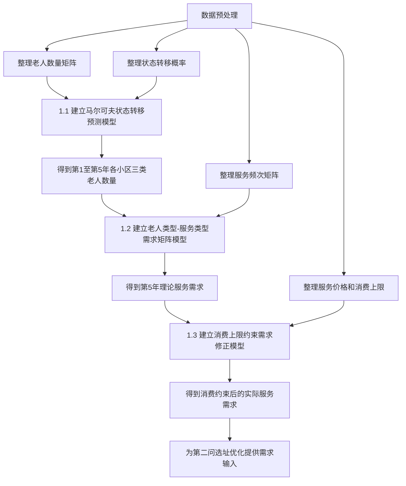

# 2026电工杯B题建模思路

## 一.老人数量预测与服务需求预测模型

### 1.1 数据预处理

在建立模型之前，需要先把题目附件中的原始数据整理成模型可以直接调用的矩阵和向量。

#### **step1：老人数量数据预处理**

将附件 1 中每个小区的老人数量整理为一个10×3的人口矩阵，其中：

- 第 1 列表示自理老人；
- 第 2 列表示半失能老人；
- 第 3 列表示失能老人；
- 行表示不同小区。

预处理时需要检查：

| 检查内容             | 处理方法                                           |
| -------------------- | -------------------------------------------------- |
| 老人数量是否为空     | 若为空，应回查原始附件，不建议随意填补             |
| 老人数量是否为负     | 若出现负数，说明数据录入有误，应修正为原始表真实值 |
| 老人数量是否为整数   | 人口数量最终应取整数                               |
| 三类老人总数是否合理 | 检查每个小区三类老人数量之和是否与小区老人总数一致 |

#### step2：状态转移概率预处理

附件 1 中给出两个关键转移概率：

p~i,12~表示小区 (i) 中自理老人一年后转为半失能老人的概率。

p~i,23~表示小区 (i) 中半失能老人一年后转为失能老人的概率。

将它们整理为转移概率表：

| 小区 | 自理转半失能概率p~i,12~ | 半失能转失能概率p~i,23~ |
| ---- | ----------------------- | ----------------------- |
| 1    | p~1,12~                 | p~1,23~                 |
| 2    | p~2,12~                 | p~2,23~                 |
| ...  | ...                     | ...                     |
| 10   | p~10,12~                | p~10,23~                |

预处理时需要检查两类概率是否在[0,1]之间。

如果附件中概率以百分数形式给出，例如 5%，需要转化为小数0.05。

#### step3:服务需求频次数据预处理

将附件 2 中三类老人对六类服务的月均需求频次整理成一个3×6的需求频次矩阵Q：

其中（k代表行，s代表列）：

| 下标 | 含义       |
| ---- | ---------- |
| k=1  | 自理老人   |
| k=2  | 半失能老人 |
| k=3  | 失能老人   |
| s=1  | 助餐       |
| s=2  | 日间照料   |
| s=3  | 上门护理   |
| s=4  | 康复理疗   |
| s=5  | 助浴       |
| s=6  | 紧急救助   |

预处理时检查矩阵的每个元素是否≥0，因为服务需求次数不能为负。

#### step4: 服务价格与消费上限预处理

- 将附件 2 中服务价格整理为价格向量：
  A=[a~1~，...，a~6~]

  其中 a~s~表示第s类服务的单次价格，单位为元/次。

- 将三类老人月消费上限整理为：
  U=[u~1~,u~2~,u~3~]

​	u~1~：自理老人月服务消费上限；

​	u~2~：半失能老人月服务消费上限；

​	u~3~：失能老人月服务消费上限。

- 预处理时需要检查a~s~和u~k~是否≥0

- 如果服务价格、消费上限以“元/月”“元/次”等不同单位出现，必须统一到：

| 数据       | 统一单位 |
| ---------- | -------- |
| 服务需求   | 次/月    |
| 服务价格   | 元/次    |
| 月消费上限 | 元/人/月 |
| 需求总量   | 次/月    |
| 消费金额   | 元/月    |

------

### 1.2 核心假设

第一问需要做人口和需求预测，因此需要设定合理假设。

| 假设条件                                                     | 合理性说明                                                   |
| ------------------------------------------------------------ | ------------------------------------------------------------ |
| 五年内各小区老人健康状态转移概率保持不变                     | 题目给出固定转移概率，且预测期只有 5 年，短期内可认为状态转移规律稳定 |
| 老人状态只能由自理向半失能、由半失能向失能转移，不考虑逆向恢复 | 题目明确说明失能老人不能恢复为半失能或自理，半失能老人不能恢复为自理 |
| 新增老人默认进入自理老人状态                                 | 新进入 60 岁以上群体的老人通常健康状况相对较好，且题目未给出新增老人失能比例 |
| 自然死亡率对三类老人统一适用                                 | 题目只给出统一自然死亡率，没有区分不同健康状态死亡率，因此采用统一死亡率 |
| 同一类老人具有相同的月均服务需求频次和消费上限               | 附件 2 按老人类型给出平均需求和消费上限，因此可用类型平均值代表该类老人 |

------

### 1.3 老人数量预测模型

#### 模型选择与解释：

本题的老人状态变化具有明显的方向性：

- 自理老人可能变成半失能；
- 半失能老人可能变成失能；
- 失能老人不会恢复；
- 半失能老人不会恢复成自理。

这种“从较健康状态向较差健康状态转移”的过程，正好符合状态转移模型的基本思想。

据此，第一问建立的**基本模型**是**马尔可夫状态转移预测模型**

这个模型的核心思想是：

> 把老人健康状况看成三种状态：自理、半失能、失能。随着时间推移，一部分自理老人会转为半失能，一部分半失能老人会转为失能，同时每年会有老人死亡，也会有新的老人进入老年群体。模型每年更新一次各类老人数量，连续递推 5 次，就可以得到未来 5 年各小区三类老人数量。

它本质上就是一个状态转移预测模型。

此外，普通马尔可夫模型只考虑“状态之间如何转移”，而本题还存在两个现实因素：

1. 老人会自然死亡；
2. 老年人口会新增。

所以本文不是直接使用普通马尔可夫链，而是引入死亡率修正和新增人口补充，建立：

**马尔可夫状态转移 + 死亡率修正 + 新增人口补充的改进模型**

这种模型比简单增长率预测更合理，因为它不仅预测总人数，还能预测不同健康状态老人结构的变化。

------

#### 模型推导：

##### step1：计算每年各小区老人总数

$T_i^t = N_{i,1}^t + N_{i,2}^t + N_{i,3}^t$

式中$T_i^t$表示第t年末小区t的老人总人数。它由自理、半失能、失能三类老人相加得到。

##### step2：计算新增老人数量

题目给出每年新增老人比例为 7%，所以：

$A_i^t = gT_i^t$

式中 $A_i^t$ 表示从第t年到第 t+1年，小区 i 新增进入老年群体的人数。

由于题目没有给出新增老人中半失能和失能比例，因此假设新增老人全部进入自理状态。

##### step3：自理老人数量递推

$N_{i,1}^{t+1} = (1 - d)(1 - p_{i,12})N_{i,1}^{t} + A_{i}^{t}$

这个式子表示：第 t+1 年自理老人数量由两部分组成。

$(1 - d)(1 - p_{i,12})N_{i,1}^{t}$表示原来自理老人中没有死亡，没有转为半失能，即仍然保持自理状态的人数。

$A_{i}^{t}$表示新增进入老年群体的人数，按假设全部计入自理老人。

##### step4：半失能老人数量递推

$N_{i,2}^{t+1} = (1 - d)\left[ p_{i,12}N_{i,1}^{t} + (1 - p_{i,23})N_{i,2}^{t} \right]$

这个式子表示：第 t+1年半失能老人由两部分组成。

$p_{i,12}N_{i,1}^{t}$ 表示由自理老人转化而来的半失能老人。

$(1 - p_{i,23})N_{i,2}^{t}$表示原半失能老人中，没有继续转为失能的人。

外面乘以（1-d）表示扣除自然死亡影响。

##### step5：失能老人数量递推

$N_{i,3}^{t+1} = (1 - d)\left[ p_{i,23}N_{i,2}^{t} + N_{i,3}^{t} \right]$

这个式子表示：第 t+1年失能老人由两部分组成。

$p_{i,23}N_{i,2}^{t}$表示由半失能老人转化而来的失能老人。

$N_{i,3}^{t}$表示原本已经失能的老人。

因为题目说明失能老人不能恢复，所以原失能老人只需要扣除死亡率，不需要考虑转出到其他状态。

------

#### 计算步骤：

------

#### 输出结果：

问题 1.1 最终应输出每个小区未来 5 年三类老人数量。建议用下表表示：

| 小区    | 年份    | 自理老人 | 半失能老人 | 失能老人 | 老人总数 |
| ------- | ------- | -------- | ---------- | -------- | -------- |
| 小区 1  | 第 1 年 |          |            |          |          |
| 小区 1  | 第 2 年 |          |            |          |          |
| ...     | ...     | ...      | ...        | ...      | ...      |
| 小区 10 | 第 5 年 |          |            |          |          |

------

### 1.4 理论服务需求预测模型

#### 模型选择与解释：

题目已经给出：

- 每个小区不同类型老人数量；
- 每类老人对六类服务的月均需求频次。

这说明需求不是凭空预测，而是由“人数”和“人均频次”直接决定。因此用需求矩阵模型最直接、最稳妥。

据此，本文建立了**老人类型—服务类型需求矩阵模型**。

这个模型的核心思想是：

> 第 5 年某小区某类老人的人数 × 该类老人对某项服务的月均需求次数 = 该类老人对该项服务的月需求总次数。

例如，如果某小区第 5 年有 100 名半失能老人，而每名半失能老人每月平均需要 3 次上门护理，那么该小区半失能老人每月上门护理需求就是：100×3=300 

所以问题 1.2 本质上是一个**矩阵乘法模型**

#### 模型推导：

##### **step1：计算分老人类型、分服务类型需求**

$R_{i,k,s}^{theory} = N_{i,k}^5 q_{k,s}$

其中$R_{i,k,s}^{theory}$表示第 5 年末，小区i中第k类老人对第s类服务的理论月需求次数。

##### step2：计算某小区某项服务总需求

$R_{i,s}^{theory} = \sum_{k=1}^{3} R_{i,k,s}^{theory} = \sum_{k=1}^{3} N_{i,k}^5 q_{k,s}$

其中$R_{i,s}^{theory}$表示小区i所有老人对第s类服务的月需求总次数。

##### step3：计算某小区全部服务总需求

$R_i^{theory} = \sum_{s=1}^{6} \sum_{k=1}^{3} N_{i,k}^5 q_{k,s}$

式中$R_i^{theory}$ 表示小区 (i) 六类养老服务的理论月需求总量。

##### step4：计算全区域某项服务总需求

$R_s^{theory} = \sum_{i=1}^{10} R_{i,s}^{theory}$

式中$R_s^{theory}$表示 10 个小区对第s类服务的理论月需求总次数。

------

#### 计算步骤：

------

#### 输出结果：

建议输出两个表：

表 1：各小区六类服务理论月需求

| 小区    | 助餐 | 日间照料 | 上门护理 | 康复理疗 | 助浴 | 紧急救助 | 合计 |
| ------- | ---- | -------- | -------- | -------- | ---- | -------- | ---- |
| 小区 1  |      |          |          |          |      |          |      |
| 小区 2  |      |          |          |          |      |          |      |
| ...     | ...  | ...      | ...      | ...      | ...  | ...      | ...  |
| 小区 10 |      |          |          |          |      |          |      |

表 2：全区域六类服务理论月需求

| 服务类型 | 理论月需求次数 |
| -------- | -------------- |
| 助餐     |                |
| 日间照料 |                |
| 上门护理 |                |
| 康复理疗 |                |
| 助浴     |                |
| 紧急救助 |                |

------

### 1.5 消费约束下服务需求修正模型

#### 模型选择与解释：

问题 1.2 算出的是“理论需求”，但现实中老人是否真的购买服务，还受到支付能力限制。

例如某类老人理论上每月需要很多护理、康复、助浴服务，但如果这些服务总费用超过该类老人月服务消费上限，那么实际需求就不能完全实现。

而且题目明确要求考虑老人消费能力，这说明理论需求不能直接作为最终服务需求。因此需要把服务需求从想要的需求修正为付得起的需求，这正是消费约束模型要解决的问题。

因此问题 1.3 需要建立一个**消费约束下的服务需求修正模型**：

> 先计算理论需求对应的总消费金额，再与消费上限比较；如果没有超过上限，则理论需求就是实际需求；如果超过上限，则按一定比例压缩服务需求，使总消费不超过消费上限。

------

#### 模型推导：

##### step1:计算理论消费金额

$M_{i,k}^{theory} = \sum_{s=1}^{6} R_{i,k,s}^{theory} a_s$

式中$M_{i,k}^{theory}$表示小区i中第k类老人如果完全满足理论服务需求，每月需要支付的总金额。

##### step2：计算最大可承受消费金额

$M_{i,k}^{max} = N_{i,k}^{5} u_k$

式中$M_{i,k}^{max}$表示小区i中第k类老人整体每月最多可以承受的服务消费金额。

例如，如果某小区有 100 名半失能老人，每人每月消费上限是 300 元，那么该小区半失能老人整体消费上限就是：100×300=30000 元/月

##### step3：判断理论消费是否超过消费上限

若$M_{i,k}^{theory}$≤$M_{i,k}^{max}$，说明理论服务需求在消费能力允许范围内，因此：

$R_{i,k,s}^{real} = R_{i,k,s}^{theory}$        $R_{i,k,s}^{real}$ 为消费约束后的实际服务需求次数，$R_{i,k,s}^{theory}$为理论服务需求。

否则说明理论需求无法完全实现，需要进行需求压缩。

##### step4：计算消费修正系数

$\theta_{i,k} = \min\left(1, \frac{M_{i,k}^{max}}{M_{i,k}^{theory}}\right)$

$\theta_{i,k}$表示理论需求能够实现的比例。

如果＝1说明不需要削减。

如果=0.8说明理论需求中大约只有 80% 能够被实际支付能力支撑。

##### step5:修正服务需求

基础修正模型为：

$R_{i,k,s}^{real} = \theta_{i,k} R_{i,k,s}^{theory}$

含义：对小区 (i) 中第 (k) 类老人所有服务需求按同一比例进行压缩，使实际需求总费用不超过消费上限。

#### 模型优化：

因为不同服务的重要程度不同，可以在基础模型上加入服务优先级

例如：

| 服务     | 特点                   |
| -------- | ---------------------- |
| 紧急救助 | 安全兜底，刚需程度最高 |
| 上门护理 | 半失能、失能老人刚需   |
| 助浴     | 失能老人生活照护刚需   |
| 康复理疗 | 健康维持服务           |
| 助餐     | 日常生活服务           |
| 日间照料 | 可被家庭照护部分替代   |

因此可以引入服务优先级权重，满足：

$\omega_s \ge 0$

$\sum_{s=1}^{6} \omega_s = 1$

一种简单处理方式是：

$R_{i,k,s}^{real} = R_{i,k,s}^{theory} \left[ \theta_{i,k} + (1 - \theta_{i,k}) \omega_s \right]$

这个式子的含义是：

- 当消费能力充足时，需求不削减；
- 当消费能力不足时，刚需服务因为权重较高，会保留更多需求；
- 非刚需服务削减幅度更大。

但是这种改进模型计算后，需要再次检查：

$\sum_{s=1}^{6} R_{i,k,s}^{real} a_s \le M_{i,k}^{max}$

如果超出消费上限，则需要进行二次归一化：

$R_{i,k,s}^{real} \leftarrow R_{i,k,s}^{real} \times \frac{M_{i,k}^{max}}{\sum_{s=1}^{6} R_{i,k,s}^{real} a_s}$​

可以在论文中写：

> 本文首先构建消费约束比例修正模型，在此基础上进一步引入服务刚需权重，对紧急救助、上门护理、助浴等刚性服务给予更高保留比例，从而使消费约束后的服务需求更符合养老服务的现实特点。

------

#### 计算步骤：

------

#### 输出结果:

问题 1.3 最终输出消费约束后的实际服务需求。

| 小区    | 助餐 | 日间照料 | 上门护理 | 康复理疗 | 助浴 | 紧急救助 | 合计 |
| ------- | ---- | -------- | -------- | -------- | ---- | -------- | ---- |
| 小区 1  |      |          |          |          |      |          |      |
| 小区 2  |      |          |          |          |      |          |      |
| ...     | ...  | ...      | ...      | ...      | ...  | ...      | ...  |
| 小区 10 |      |          |          |          |      |          |      |

还可以增加一个对比表：

| 小区   | 理论需求总次数 | 消费约束后需求总次数 | 需求实现率 |
| ------ | -------------- | -------------------- | ---------- |
| 小区 1 |                |                      |            |
| 小区 2 |                |                      |            |
| ...    | ...            | ...                  | ...        |

------

### 1.6 第一问总流程

第一问完整建模流程如下：

